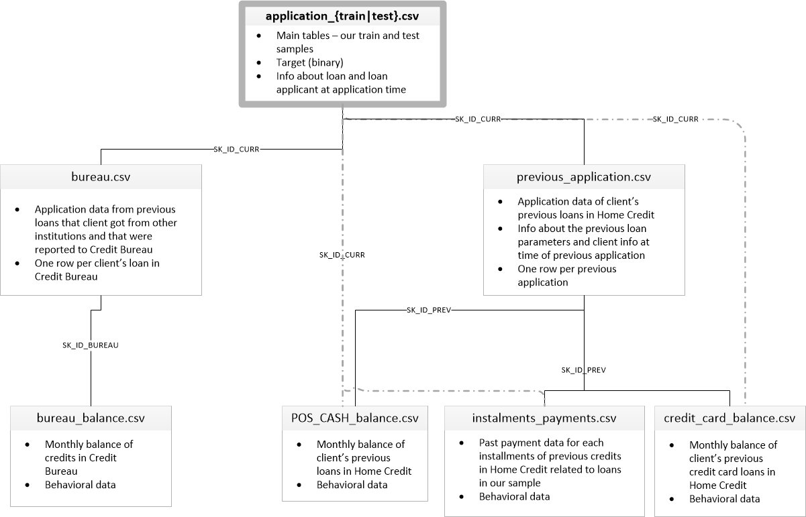

# 📊 Structure des Données - Home Credit Default Risk

## Schéma Relationnel



## 📋 Description des Tables

### 🎯 Table Principale

#### **application_{train|test}.csv**
- **Description:** Tables principales contenant les échantillons d'entraînement et de test
- **Contenu:** 
  - Target (binaire) - 0 = pas de défaut, 1 = défaut de paiement
  - Informations sur le prêt et le demandeur au moment de la demande
- **Clé primaire:** `SK_ID_CURR` (ID unique du client)
- **Taille:** 307,511 lignes (train) × 122 colonnes
- **Déséquilibre:** 92% classe 0 / 8% classe 1

---

### 📦 Tables Secondaires

#### 1. **bureau.csv**
- **Description:** Données sur les prêts antérieurs du client auprès d'autres institutions financières rapportés au Bureau de Crédit
- **Relation:** Une ligne par prêt du client auprès du Bureau de Crédit
- **Clé étrangère:** `SK_ID_CURR` → application_{train|test}.csv
- **Clé primaire:** `SK_ID_BUREAU`
- **Taille:** 1,716,428 lignes
- **Informations:**
  - Montant du crédit
  - Jours de retard
  - Type de crédit (carte, prêt auto, hypothèque, etc.)
  - Statut (actif, fermé, vendu, etc.)

#### 2. **bureau_balance.csv**
- **Description:** Soldes mensuels des crédits du Bureau de Crédit
- **Relation:** Données comportementales mensuelles pour chaque crédit du Bureau
- **Clé étrangère:** `SK_ID_BUREAU` → bureau.csv
- **Taille:** 27,299,925 lignes (⚠️ TRÈS VOLUMINEUSE)
- **Informations:**
  - Historique mois par mois
  - Statut de paiement (à jour, retard, fermé)
  - Comportement de remboursement

#### 3. **previous_application.csv**
- **Description:** Demandes de prêt antérieures du client chez Home Credit
- **Relation:** Une ligne par demande antérieure
- **Clé étrangère:** `SK_ID_CURR` → application_{train|test}.csv
- **Clé primaire:** `SK_ID_PREV`
- **Taille:** 1,670,214 lignes
- **Informations:**
  - Montant demandé vs accordé
  - Paramètres du prêt précédent
  - Statut de la demande (approuvée, refusée, annulée)
  - Informations au moment de la demande précédente

#### 4. **POS_CASH_balance.csv**
- **Description:** Soldes mensuels des prêts au point de vente (POS) et en espèces du client chez Home Credit
- **Relation:** Données comportementales mensuelles pour les prêts POS/Cash
- **Clé étrangère:** `SK_ID_PREV` → previous_application.csv
- **Taille:** 10,001,358 lignes
- **Informations:**
  - Historique de paiement mensuel
  - Retards (DPD - Days Past Due)
  - Solde restant

#### 5. **installments_payments.csv**
- **Description:** Historique des paiements échelonnés pour les crédits antérieurs chez Home Credit
- **Relation:** Données de paiement passé pour chaque échéance des crédits antérieurs
- **Clé étrangère:** `SK_ID_PREV` → previous_application.csv
- **Taille:** 13,605,401 lignes
- **Informations:**
  - Montant prévu vs payé
  - Date prévue vs date réelle de paiement
  - Comportement de remboursement détaillé

#### 6. **credit_card_balance.csv**
- **Description:** Soldes mensuels des cartes de crédit du client chez Home Credit
- **Relation:** Données comportementales mensuelles pour les cartes de crédit
- **Clé étrangère:** `SK_ID_PREV` → previous_application.csv
- **Taille:** 3,840,312 lignes
- **Informations:**
  - Solde mensuel
  - Limite de crédit
  - Paiements minimums
  - Retraits et utilisations

---

## 🔗 Relations Entre les Tables

### Hiérarchie des Clés

```
application_{train|test}.csv (SK_ID_CURR)
    │
    ├─→ bureau.csv (SK_ID_CURR, SK_ID_BUREAU)
    │       │
    │       └─→ bureau_balance.csv (SK_ID_BUREAU)
    │
    └─→ previous_application.csv (SK_ID_CURR, SK_ID_PREV)
            │
            ├─→ POS_CASH_balance.csv (SK_ID_PREV)
            ├─→ installments_payments.csv (SK_ID_PREV)
            └─→ credit_card_balance.csv (SK_ID_PREV)
```

### Relations Détaillées

1. **application_{train|test} ← bureau** (1:N)
   - Un client peut avoir plusieurs crédits bureau
   - Jointure: `SK_ID_CURR`

2. **bureau ← bureau_balance** (1:N)
   - Chaque crédit bureau a un historique mensuel
   - Jointure: `SK_ID_BUREAU`

3. **application_{train|test} ← previous_application** (1:N)
   - Un client peut avoir plusieurs demandes antérieures
   - Jointure: `SK_ID_CURR`

4. **previous_application ← {POS, installments, credit_card}** (1:N)
   - Chaque demande antérieure peut avoir des données comportementales
   - Jointure: `SK_ID_PREV`

---

## 📊 Statistiques Globales

| Table | Lignes | Clé | Relation |
|-------|--------|-----|----------|
| application_train | 307,511 | SK_ID_CURR (PK) | - |
| application_test | 48,744 | SK_ID_CURR (PK) | - |
| bureau | 1,716,428 | SK_ID_BUREAU (PK), SK_ID_CURR (FK) | 1:N avec application |
| bureau_balance | 27,299,925 | SK_ID_BUREAU (FK) | 1:N avec bureau |
| previous_application | 1,670,214 | SK_ID_PREV (PK), SK_ID_CURR (FK) | 1:N avec application |
| POS_CASH_balance | 10,001,358 | SK_ID_PREV (FK) | 1:N avec previous |
| installments_payments | 13,605,401 | SK_ID_PREV (FK) | 1:N avec previous |
| credit_card_balance | 3,840,312 | SK_ID_PREV (FK) | 1:N avec previous |

**Total:** ~58 millions de lignes de données comportementales

---

## 🎯 Stratégie d'Agrégation

Pour utiliser ces données dans un modèle de ML, nous devons agréger les tables secondaires au niveau client (`SK_ID_CURR`):

### Étape 1: Bureau
```python
bureau_agg = bureau.groupby('SK_ID_CURR').agg({
    'AMT_CREDIT_SUM': ['sum', 'mean', 'max'],
    'CREDIT_DAY_OVERDUE': ['max', 'mean'],
    # ... autres agrégations
})
```

### Étape 2: Bureau Balance (via Bureau)
```python
# Agréger d'abord par SK_ID_BUREAU
bb_agg = bureau_balance.groupby('SK_ID_BUREAU').agg(...)

# Puis joindre à bureau et agréger par SK_ID_CURR
bureau_with_bb = bureau.merge(bb_agg, on='SK_ID_BUREAU')
bb_client = bureau_with_bb.groupby('SK_ID_CURR').agg(...)
```

### Étape 3: Previous Application
```python
prev_agg = previous_application.groupby('SK_ID_CURR').agg(...)
```

### Étape 4: Tables liées à Previous (via Previous)
```python
# Même principe: agréger par SK_ID_PREV, puis par SK_ID_CURR
pos_agg = POS_CASH.groupby('SK_ID_PREV').agg(...)
prev_with_pos = previous.merge(pos_agg, on='SK_ID_PREV')
pos_client = prev_with_pos.groupby('SK_ID_CURR').agg(...)
```

### Étape 5: Fusionner avec application_train
```python
df = application_train.copy()
df = df.merge(bureau_agg, on='SK_ID_CURR', how='left')
df = df.merge(bb_client, on='SK_ID_CURR', how='left')
df = df.merge(prev_agg, on='SK_ID_CURR', how='left')
# ... etc
```

**Résultat:** 122 → 250+ colonnes

---

## 💡 Conseils Importants

### Gestion de la Mémoire
⚠️ **bureau_balance.csv** fait 27M de lignes → utiliser l'agrégation en 2 étapes pour économiser la RAM

### Imputation
Les clients sans historique bureau/previous auront des NaN → imputer à 0 après la jointure LEFT

### Features Dérivées
Créer des ratios métier:
- `BUREAU_DEBT_RATIO = AMT_CREDIT_SUM_DEBT / AMT_CREDIT_SUM`
- `PREV_APPROVAL_RATE = STATUS_APPROVED / (APPROVED + REFUSED)`
- `BB_LATE_RATE = LATE_MONTHS / TOTAL_MONTHS`

### Encodage Catégoriel
Utiliser One-Hot Encoding pour les statuts (Active/Closed, Approved/Refused, etc.)

---

## 📚 Ressources

- **Notebook d'agrégation:** `notebooks/01_aggregation_tables.ipynb`
- **Documentation Kaggle:** https://www.kaggle.com/c/home-credit-default-risk/data
- **Guide d'agrégation:** `GUIDE_AGGREGATION_TABLES_P7.md`

---

**🎯 Prochaine étape:** Exécuter le notebook 01 pour créer `application_train_AGGREGATED.csv`
